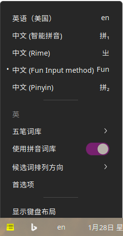
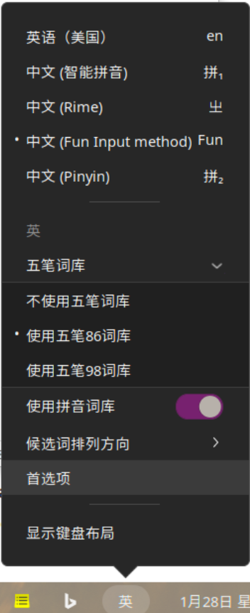
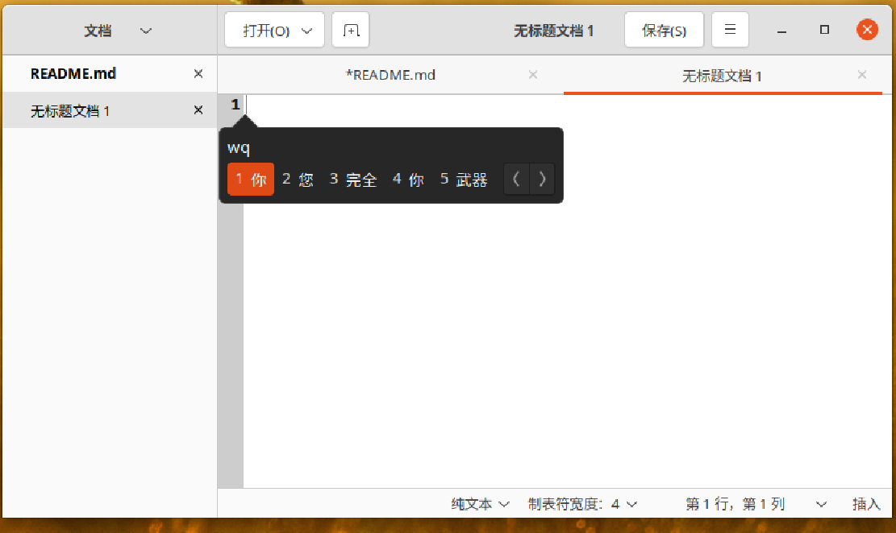
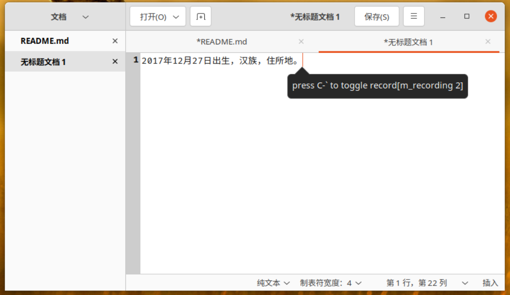

# intruction

一个Linux下的基于IBus的,支持五笔拼音混输, 支持单纯拼音输入,支持五笔输入,还支持语音输入的输入法.


Code under pinyin folder and dictionary file res/dict_pinyin.dat come from [Google pinyin IME](https://android.googlesource.com/platform/packages/inputmethods/PinyinIME).


# Build and Install

这是一个cmake工程,所有用正常的cmake编译就行了.

```bash
mkdir build
cd build
cmake ..
make
sudo make install
```

你也可以先构建一个deb包, 然后再安装deb包:

```bash
mkdir build
cd build
cmake ..
make
cpack
sudo dpkg -i audio_ime-1.1-Linux.deb

```

# Snapshots







